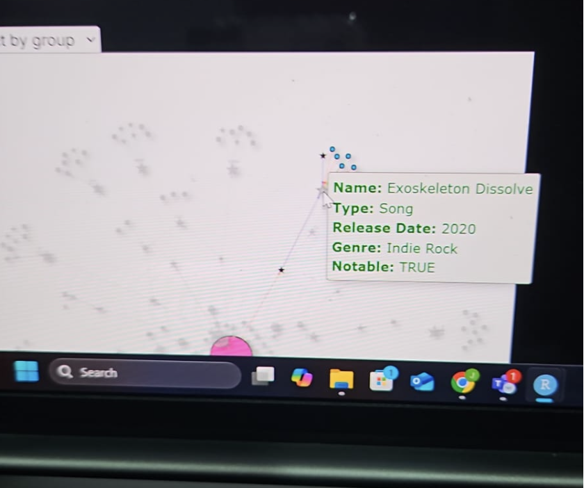

Group 11: Meeting Minutes 5

Date: 3 July 2025

Time: 2100hrs to 2130hrs

In Attendance: Andre Ong, Ng Jin Yao, Nor Hendra Bin Abdul Rahman

Opening:

The meeting was called to order at 2100hrs by the group for an online discussion

# Agenda Item 1: Tweaking Loose Ends

The team shared what needs to be tweaked for our Shiny App and Final Deliverables. Jin Yao has planned to change some of the nodes color and CSS for the visNetwork. The goal of his plan is to change the description of the visNetwork to be in green - to align with our Spotify theme.

Andre also shared that he will be making some tweaks for his plots to resize them and some other minor changes to clean up the plots. This is just a nudge towards a cleaner, visually attractive Shiny App.

Hendra asked how long this would take as the user guide needs to be created based on the latest changes. Jin Yao and Andre agreed that they could finish it within the night itself so that Hendra can work on the user guide the day after. Hendra also mentioned how he will add on the description on the right sidebar for each tab.

# Follow-Up Tasks

1.  Minor tweaks to plots
2.  User Guide
3.  Polishing up the Shiny App for presentation-ready seminar

There will be no need for further meetings as all of these are minor tweaks. The User Guide will be shared via WhatsApp for a read-through and can be discussed there without having a need for another official meeting.

Adjournment

The meeting adjourned at 2130hrs with excited of what we have to share to our classmates and Prof Kam.
