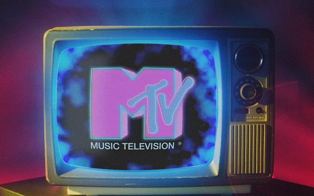
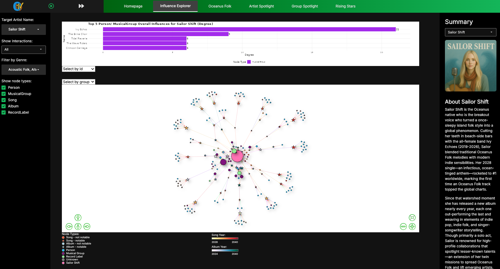

```{=html}
<style>
p {
  text-align: justify;
}
body, 
body p, 
body h1, 
body h2, 
body h3, 
body h4, 
body h5, 
body h6

}
</style>
```

# Brief Overview

{width="682"}

MTV began life on 1 August 1981, when a scrappy Warner-Amex team filled an empty cable slot with wall-to-wall music videos. The debut clip, “Video Killed the Radio Star,” captured the channel’s mission perfectly: marry sound and vision so completely that viewers would never listen the same way again. Neon logos, splash animations, and fast-talking VJs soon formed a visual shorthand that told audiences, almost by reflex, “lean in—something loud and new is coming.”

{width="613"}

Spotify’s story opened twenty-five years later. Founded in April 2006 and released to the public in October 2008, the Swedish platform answered a different need: how to make streaming as quick as piracy yet legal, social, and friction-free. A dark interface, an emerald play button, and instant playback turned listening into a swift, on-demand act. Those UI cues taught users a fresh mental model: playlists are fluid, discovery is algorithmic, and any track is one tap away.



Our Shiny app unites these two legacies. The header flashes an MTV-style splash logo, priming users for bold storytelling, while the rest of the screen adopts Spotify’s charcoal backdrop, green controls, and hover-reactive cards. Familiar heuristics kick in at once: green means play, muted grays keep data in focus, and icons behave exactly as decades of music interfaces have taught. Because viewers already understand both visual languages, they can dive straight into Sailor Shift’s influence graphs, slide along Oceanus Folk timelines, and flip filters as naturally as they queue songs. What began in 1981 as televised video and evolved in 2008 into cloud streaming now powers a data-rich exploration—turning analytics into an experience that feels as instinctive, and as fun, as pressing play on a favorite track.

Check out our [poster](https://oceanustv.netlify.app/poster/poster) for more information on each navigation tab! Don't forget to hit play on the Shiny App, enjoy the music and explore our data visualisation.
